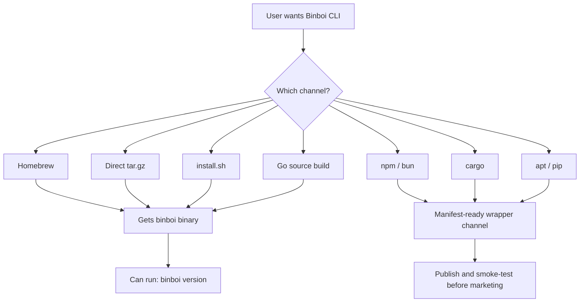

# Binboi Install Channel Matrix

This document explains what a user should expect from each install channel today.

It is intentionally honest about what is production-ready, what is contributor-only, and what is not published yet.

## Recommended Order

Use these install paths in this order:

1. Homebrew
2. Direct release binary
3. `install.sh`
4. Build from source with Go

Avoid promising these paths yet:

- npm
- bun
- cargo
- apt
- pip

## Channel Status Matrix

| Channel | Current status | What the user gets | Notes |
| --- | --- | --- | --- |
| Homebrew | Supported packaging path | `binboi` on `PATH` | Best macOS UX when the tap/release is published correctly |
| Direct binary tar.gz | Supported | `binboi` binary | Best universal release path today |
| `install.sh` | Supported | `binboi` installed from GitHub release artifacts | Uses release archives instead of relying on local Go naming |
| `go build -o binboi ./cmd/binboi-client` | Supported for contributors | local `binboi` binary | Best source path when working in the repo |
| `go install github.com/miransas/binboi/cmd/binboi-client@latest` | Technically possible but not the primary user path | `binboi-client` in Go bin directory | Good for contributors, but the binary name is not the product-facing `binboi` name |
| `npm install -g @miransas/binboi` | Manifest-ready, not published | Wrapper package metadata plus verify hook | Registry publishing and native binary bundling are still pending |
| `bun add -g @miransas/binboi` | Manifest-ready, not published | Same wrapper metadata as npm | Bun can use the npm package once it is published |
| `cargo install miransas-binboi` | Manifest-ready, not published | Wrapper crate metadata plus verify guidance | Crate publishing and native binary bundling are still pending |
| `apt install binboi` | Manifest-ready, not published | Debian control metadata plus post-install verify hook | APT repository and signed `.deb` artifacts are still pending |
| `pip install binboi` | Manifest-ready, not published | Python wrapper metadata plus verify guidance | PyPI publishing and native binary bundling are still pending |

## What Happens Today

### Homebrew

Expected user command:

```bash
brew install binboi/tap/binboi
binboi version
```

Expected outcome:

- the user gets a `binboi` executable on `PATH`
- this is the cleanest macOS install path
- it depends on release archives and a maintained formula

### Direct release binary

Expected user flow:

```bash
tar -xzf binboi_<version>_<os>_<arch>.tar.gz
sudo mv binboi_<version>_<os>_<arch>/binboi /usr/local/bin/binboi
binboi version
```

Expected outcome:

- the user gets the exact release binary
- the binary name is `binboi`
- this is the safest install path when you want the release artifact directly

### `install.sh`

Expected user command:

```bash
curl -fsSL https://raw.githubusercontent.com/Miransas/binboi/main/install.sh | bash
```

Expected outcome:

- the script resolves the latest GitHub release
- it downloads the matching archive for the local OS and architecture
- it installs `binboi` into `/usr/local/bin`

### Go source build

Expected contributor command:

```bash
go build -o binboi ./cmd/binboi-client
./binboi version
```

Expected outcome:

- the user gets a local `binboi` binary
- this is the recommended source path for contributors and local development

### `go install`

Expected contributor command:

```bash
go install github.com/miransas/binboi/cmd/binboi-client@latest
```

Expected outcome:

- Go installs a binary named after the package directory
- the installed command is expected to be `binboi-client`, not `binboi`
- this makes it less ideal as the main end-user distribution story

## Why npm, bun, cargo, apt, and pip are not launch channels yet

From the current repository state:

- packaging manifests now exist for npm, Bun, Cargo, Debian, and PyPI
- there is still no public registry release automation for these channels
- wrapper channels still point operators back to GitHub releases for the native CLI

That means these channels are now packaging-ready, but they still should not be marketed as live install promises until they are published and smoke-tested.

## Release Diagram



## Product Recommendation

For the current launch:

- market Homebrew and direct binary as the real installation story
- keep `install.sh` as a convenience path
- treat Go as contributor-facing
- do not market npm, bun, cargo, apt, or pip as supported until they are actually published and tested

_Documentation maintained by Sardor Azimov, Miransas._
